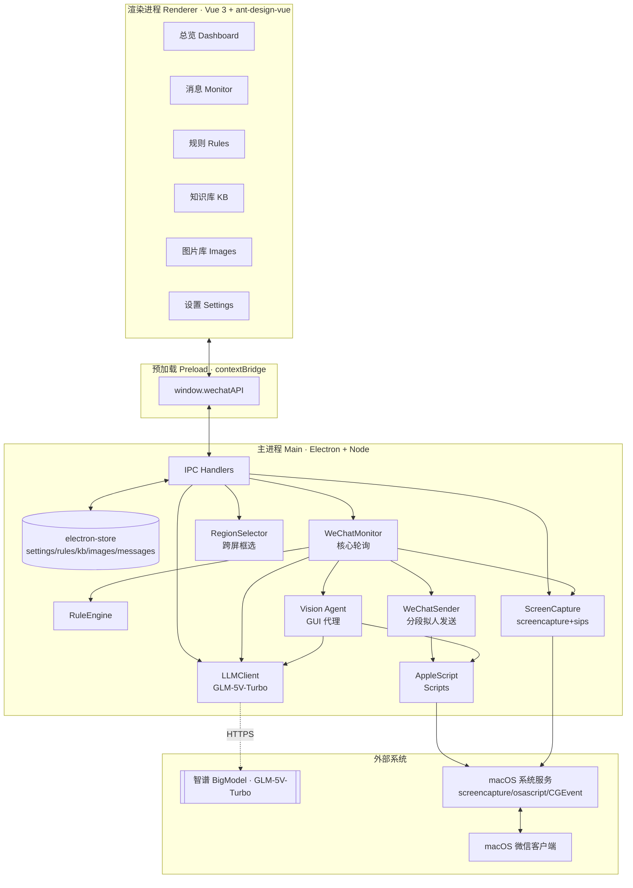
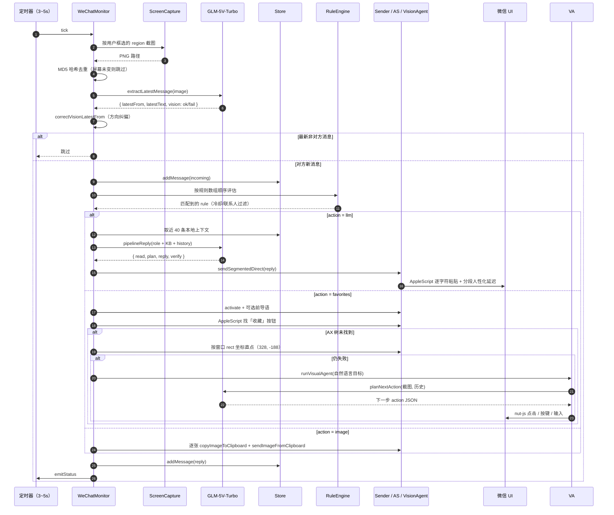

# 微信智能助手（wechat-auto）系统架构方案

> 版本：v1.0 · 产品方案/架构说明
> 适用范围：macOS 桌面端微信聊天自动化助手
> 文档目标：向管理层与跨团队同事说明产品定位、整体架构、关键技术链路与风险控制点

---

## 1. 产品定位与业务价值

### 1.1 一句话定位

**一款运行在 Mac 本地的微信聊天智能副驾**：在「不依赖微信官方 API、不登录 Web/iPad 协议、不碰 hook」的前提下，通过「屏幕视觉 + GUI 自动化」实现对指定联系人/群的自动化阅读、理解、回复与物料派发（文本 / 图片 / 收藏夹「位置」）。

### 1.2 典型业务场景

| 场景 | 痛点 | 本产品做的事 |
| --- | --- | --- |
| HR / 招聘助理批量筛简历 | 每天几十个求职者同一句「在吗」「看到岗位」要逐条回复 | 命中关键词 → AI 按知识库（岗位介绍）自动回复 |
| 门店 / 服务地址群发 | 客人反复问「地址发一下」，手动翻收藏发位置效率低 | 命中关键词 → 自动打开收藏夹、勾选前 N 条「位置」、一键群发 |
| 活动物料派发 | 客服要发产品图、二维码、海报 | 命中关键词 → 按顺序将图片库中 1~N 张图逐张发送 |
| 客户咨询 7×24 兜底 | 非工作时间消息得不到及时回复 | AI 基于本地对话上下文 + 知识库生成拟人回复 |

### 1.3 核心价值

- **零侵入**：不逆向、不 hook、不动微信本体；用户只需要授权「屏幕录制」与「辅助功能」两项系统权限。
- **本地化**：消息、规则、知识库、图片库全部落在 `electron-store` 管理的本地 `userData` 中，不经服务端。
- **大模型原生**：统一使用 **智谱 GLM-5V-Turbo**（视觉 + 文本一体），既做 OCR/消息抽取，又做回复生成，还作为 GUI Agent 兜底操作，链路短、一致性高。
- **可运营**：运营/业务方可自助配置规则、知识库与物料，不需要二次开发。

---

## 2. 整体架构图

### 2.1 分层架构（鸟瞰）



### 2.2 关键运行时：自动回复一次轮询的数据流



---

## 3. 技术栈

| 层 | 选型 | 说明 |
| --- | --- | --- |
| 应用外壳 | **Electron 39** | 跨平台桌面容器，主/渲染双进程隔离 |
| 构建 | electron-vite + electron-builder | 开发/打包一体化 |
| UI | **Vue 3 + ant-design-vue 4 + Pinia + vue-router** | 成熟中后台栈 |
| 样式 | Tailwind CSS 4 | 原子化，配合 AntDV |
| 主进程核心 | TypeScript + Node.js | 严格类型 |
| 持久化 | **electron-store** | JSON 文件，用户 `userData` 目录 |
| 大模型 | **智谱 GLM-5V-Turbo**（OpenAI 协议兼容） | 视觉 + 文本 + GUI grounding 三位一体 |
| SDK | `openai` npm 包（指 BigModel baseURL） | 复用 OpenAI Chat Completions 接口 |
| 屏幕控制 | macOS `screencapture` + `sips`（截图/裁剪）、`osascript`（AppleScript）、`@nut-tree-fork/nut-js`（鼠标键盘事件 / CGEventPost） | 多链路冗余 |
| 图标 / 图形 | @ant-design/icons-vue | 与 AntDV 一致 |

---

## 4. 模块详解

### 4.1 主进程模块清单

```
src/main/
├── index.ts              # 启动入口：注册 wechat-img:// 协议、IPC、LLM 配置、创建窗口
├── store.ts              # electron-store 封装，带历史数据迁移（regex/at_me → all；template → prefaceTemplate）
├── types.ts              # 全局类型定义（Message / AutoReplyRule / AppSettings / LibraryImage …）
├── ruleEngine.ts         # 规则引擎（当前轻量，匹配逻辑内嵌在 monitor 中）
├── regionSelector.ts     # 跨屏幕「拖拽框选」覆盖层，返回 {displayId,x,y,w,h}
├── ipc/handlers.ts       # 所有 IPC handler，渲染进程的唯一入口
├── ocr/
│   ├── capture.ts        # screencapture -D + sips 精准裁剪（支持多显示器 scaleFactor）
│   └── recognize.ts      # 备用 OCR（目前主路径已用视觉大模型替代）
├── llm/
│   ├── client.ts         # GLM 客户端（pipelineReply / extractLatestMessage / locateOnScreen / planNextAction）
│   └── pipelinePrompt.ts # 固定「读取→规划→执行→校验」JSON 指令模板
└── wechat/
    ├── applescript.ts    # 全部 osascript 脚本：激活、navigateToChat、逐字符粘贴发送、收藏群发、对话框 bounds
    ├── controller.ts     # WeChat 操作统一门面
    ├── sender.ts         # 分段发送（1~3 段）+ 拟人延迟 + 超时自适应
    ├── splitReply.ts     # 中文标点切段 + 桶均衡 + 随机抖动
    ├── visionAgent.ts    # 「看屏幕→规划→执行→再看」闭环 GUI Agent
    ├── monitor.ts        # 核心轮询与编排（~680 行）
    └── scripts/*.applescript  # 备用独立脚本
```

### 4.2 渲染进程模块清单

```
src/renderer/src/
├── App.vue               # 侧栏 + 路由外壳，订阅监控状态（running 指示灯）
├── main.ts
├── router/index.ts       # 6 个视图路由
├── stores/               # Pinia：chat / rules / settings
├── components/
│   └── ReplyPipelinePanel.vue   # 展示「读→规→执→验」四步思考流水线
├── views/
│   ├── DashboardView.vue        # 总览：监控开关、状态、消息计数
│   ├── MonitorView.vue          # 实时消息流 + AI 思考过程展示
│   ├── RulesView.vue            # 规则可视化编辑（拖拽排序 = 优先级）
│   ├── KnowledgeBaseView.vue    # 知识库 CRUD
│   ├── ImageLibraryView.vue     # 图片库（复制到 userData/images/，wechat-img:// 预览）
│   └── SettingsView.vue         # LLM API Key / 轮询间隔 / 联系人白名单 / 框选区域
└── types/index.ts
```

### 4.3 数据模型（摘）

```ts
AutoReplyRule {
  id, name, enabled, contacts[],
  trigger:   { type: 'keyword' | 'all', value? },
  action:    {
    type: 'llm' | 'favorites' | 'image',
    systemPrompt?, knowledgeBaseId?,      // llm
    prefaceTemplate?, maxFavorites?,      // favorites
    imageIds?, imagePath?                 // image
  },
  cooldown   // 秒
}

MessagePipeline { read, plan, execute, verify }   // AI 侧四步思考
LibraryImage   { id, name, path, size, createdAt }
KnowledgeBase  { id, name, content, updatedAt }
LLMSettings    { apiKey, baseURL(锁死), model(锁死), systemPrompt, temperature }
```

---

## 5. 关键链路设计

### 5.1 「视觉抽取最新消息」—— 取代传统 OCR

- 直接把 region 截图送给 **GLM-5V-Turbo**，要求返回严格 JSON：

  ```json
  { "vision": "ok|fail", "reason": "...", "chatTitle": "...", "latestFrom": "them|me|unknown", "latestText": "..." }
  ```

- 判定「对方/我方」使用**气泡位置（左/右）**而非文字内容，避免幻觉。
- `thinking: { type: 'disabled' }` 关闭思考，节省输出 token 并防止 JSON 被截断。
- 失败分级：
  - 纯视觉 fail → 60s 内相同 hash 不再重试，避免烧 token。
  - latestFrom=unknown 但有文本 → 自动纠正为 `them`。
  - 同一屏连续 2 次被判 `me`（且本地会话为空）→ 强制按 `them` 处理（处理"模型把左侧对方气泡错标我"的边界 case）。

### 5.2 「四步思考」回复生成

系统 Prompt 强制返回四字段 JSON：

```json
{ "read": "...", "plan": "...", "reply": "...", "verify": "..." }
```

- `reply` 是唯一会被真正发送的字段；`read/plan/verify` 仅展示在前端监控面板，给运营「AI 在想什么」的白盒感。
- 上下文拼装：`rolePrompt` + `knowledgeBase.content` + 最近 40 条本地消息。

### 5.3 「收藏群发」三级回退（最硬核路径）

这是对 macOS 微信最复杂的一段自动化，也是本产品最具差异化的能力：

| 级别 | 方案 | 失败触发下一级的原因 |
| --- | --- | --- |
| L1 | **AppleScript 遍历 AX 树** 找「收藏」按钮（name/description/title/help/value 含"收藏"/"Favorite"） | 微信新版把收藏按钮的 name/title 全部置空 → `ERR_FAVORITES_BUTTON` |
| L2 | **窗口 rect 坐标直点**：按微信窗口左下角固定偏移 `(+328, -188)` 点击，再通过 AppleScript 拿到「发送收藏给 xxx」对话框 bounds，按比例 `(0.55, 0.26/0.50/0.74)` 勾选前 3 条，`(0.92, 0.93)` 点「发送」 | 微信窗口 DPI/尺寸变化、首屏不是「位置」分类 |
| L3 | **视觉 GUI Agent**：把自然语言目标交给 GLM-5V-Turbo，循环「截图 → planNextAction → 执行 click/key/type/wait → 再截图」最多 N 步，bbox 小于 8px 视为幻觉丢弃 | 兜底彻底失败返回 `ERR_VISUAL_AGENT` |

三级合起来在真实环境下可稳定打开收藏面板、勾选 N 条位置并群发。

### 5.4 「拟人化」发送策略

- **逐字符粘贴**（剪贴板 + ⌘V），字符间 6~20ms 随机延迟 → 输入框内可见"一个字一个字"出现，视觉上像真人打字。
- **分段切分**：`splitReply.ts` 按标点把长回复切成 1~3 段，桶均衡 + 随机抖动，发送前插入「思考 400~1200ms + 打字 + jitter」延迟。
- **超时自适应**：按字符数线性估算 AppleScript timeout，下限 15s、上限 120s。

### 5.5 多显示器与 DPI

- 截图链路：`screencapture -D <displayId>` 按指定显示器拿物理像素图 → `sips` 按 region 裁剪。
- 坐标换算：`rect.x + px / scaleFactor` 让 Retina、扩展屏、副屏场景下 GUI 点击点都落在正确像素。
- 框选 overlay：为**每块显示器**各自创建一个全屏透明 BrowserWindow，支持跨屏拖拽。

### 5.6 本地图片通过自定义协议安全预览

- 注册 `wechat-img://<id>` 协议（`registerSchemesAsPrivileged` + `protocol.handle`），渲染端 `` 即可看到图片库图片，无需暴露本地文件路径。

---

## 6. 存储与持久化

所有数据通过 `electron-store` 以 JSON 持久化在 `~/Library/Application Support/wechat-auto/`：

| 键 | 内容 | 备注 |
| --- | --- | --- |
| `settings` | LLM 配置 / 监控配置 | **baseURL/model 在读写时强制锁定**为 GLM-5V-Turbo，避免用户误改 |
| `rules[]` | 规则数组，**数组顺序 = 优先级**（UI 可拖拽） | 自带历史字段迁移逻辑 |
| `knowledgeBases[]` | 知识库条目 | `updatedAt` 倒序 |
| `images[]` | 图片库元数据 | 文件物理存于 `userData/images/`，id 稳定 |
| `messages[]` | 消息流水 | 滚动保留最后 500 条 |

---

## 7. 权限与安全

| 维度 | 设计 |
| --- | --- |
| 系统权限 | 需要用户在「系统设置 → 隐私与安全性」中为本 App 开启**屏幕录制**和**辅助功能** |
| 数据边界 | 所有业务数据本地化，仅 LLM 请求出网（走 HTTPS → `open.bigmodel.cn`） |
| API Key | 存储在 `electron-store`（用户 userData，系统权限管控），不回传服务器 |
| 上下文隔离 | preload 使用 `contextBridge` 注入白名单 API，渲染进程无法直接访问 Node/Electron |
| 协议私有化 | `wechat-img://` 仅在主进程内解析，渲染进程拿不到真实文件路径 |
| 反识别 | 本产品仅读取屏幕 + 模拟键鼠，不注入/不 hook 微信进程，符合**不改动第三方软件**原则 |

---

## 8. 性能与成本

| 项 | 值 | 说明 |
| --- | --- | --- |
| 轮询周期 | 默认 5s，下限 3s | 可配置 |
| 屏幕不变快速短路 | MD5 hash 比对 | 不消耗 LLM token |
| 已处理屏去重 | `processedScreenHashes` 集合 | 防 duplicate 回复 |
| 视觉失败冷却 | 相同 hash 60s 内不重试 | 防止烧 token |
| LLM 调用次数 | 每轮最多 1~2 次（抽取 + 可能的回复）；Agent 兜底另算 | 状态面板有 llmCalls 计数 |
| GLM 输出上限 | 128K tokens | 充足 |
| 平均每条回复延迟 | 视觉 1~2s + 生成 2~4s + 分段打字 1~6s ≈ 5~12s | 视网络与回复长度 |

---

## 9. 典型用户使用路径

1. **首次安装** → 设置页填入 GLM API Key → 测试连通性。
2. **框选** 微信聊天区域（支持跨屏、Retina）。
3. **配置规则**：拖拽排序定优先级；每条规则选 `联系人白名单 / 关键词 / 动作类型（AI/收藏/图片）`。
4. （可选）维护**知识库**（例如「岗位 JD + FAQ」）绑定到某条 AI 规则。
5. （可选）上传**图片库**（海报/二维码/产品图）绑定到图片动作规则。
6. **点击开始监控** → 状态指示灯变绿 → 监控页实时看消息流和 AI 四步思考。
7. **随时停止**；所有数据保留。

---

## 10. 演进路线（提案）

| 阶段 | 能力 | 目标 |
| --- | --- | --- |
| **现状（v1.0）** | macOS 单机；单窗口；单联系人优先；三种动作 | MVP 已跑通，可上线小范围灰度 |
| **v1.1 — 体验** | 联系人多开 + 每会话独立截图区；规则预览+试跑；消息流导出；失败告警通知中心 | 提升运营可观察性 |
| **v1.2 — 能力** | 支持语音消息转写（GLM 语音）；支持引用回复/@人；支持本地向量化知识库（嵌入检索而非全量注入） | 适配更复杂客服场景 |
| **v1.3 — 稳定性** | 自动重试 + 指数退避；微信 UI 版本自适应（把坐标偏移抽成版本配置，按 AX 树指纹切换）；每日健康巡检 | 降低运维成本 |
| **v1.4 — 平台化** | Windows 版（用 PowerShell/UIAutomation 替代 AppleScript，其余复用）；可选云端规则中心（企业统一下发） | 拓展到 Windows 工作站 |
| **v2.0 — 多模型 / 本地化** | 抽象 LLM Provider（OpenAI / Claude / 本地 Ollama）；端侧小模型做"是否值得回"预筛，降本 50%+ | 降本 + 数据合规可选项 |

---

## 11. 风险与缓解

| 风险 | 等级 | 缓解 |
| --- | --- | --- |
| 微信桌面端版本升级导致 AX 结构或窗口尺寸变化 | 中高 | 三级回退 + 视觉 Agent 兜底；坐标偏移集中常量化 |
| GLM 偶发把「我」气泡识别成「对方」 | 中 | `correctVisionLatestFrom` 四条纠偏规则；同屏 2 连误判强制纠正 |
| 大模型产生不合适回复 | 中 | `verify` 自检字段 + 未来加入关键词黑名单过滤；运营可直接看四步思考决定是否保留该规则 |
| API Key 泄露 | 低 | 仅本地存储；建议用户在 BigModel 控制台绑定单 App 限额 Key |
| 长时间无人值守的 token 消耗 | 低 | 屏幕 hash 短路 + 失败 60s 冷却；前端实时 `llmCalls` 计数 |
| 用户忘记授予辅助功能权限 | 低 | 启动时错误日志 + 动作级错误提示明确给出权限指引 |

---

## 12. 交付边界（当前版本）

**已实现**

- [x] Mac 端 Electron 应用（dev/build 链路完整）
- [x] 框选截图区域（跨屏 + Retina 正确）
- [x] GLM-5V-Turbo 视觉抽最新消息 + 方向判定 + 纠偏
- [x] 四步思考 pipeline 回复（含知识库与本地上下文）
- [x] 拟人分段 + 逐字符粘贴发送
- [x] 收藏群发三级回退（AX → 坐标 → 视觉 Agent）
- [x] 图片库批量顺序发送
- [x] 规则 / 知识库 / 图片库 / 设置完整前端
- [x] electron-store 持久化 + 历史字段迁移
- [x] `wechat-img://` 本地图安全预览协议

**暂未实现**

- [ ] Windows 平台
- [ ] 多会话并行监控
- [ ] 引用/@/ 撤回等消息特性
- [ ] 云端规则同步 / 多设备协同
- [ ] 语音 / 视频号 / 小程序分享消息

---

## 附录 A：核心代码地图

| 关注点 | 文件 |
| --- | --- |
| 应用启动与窗口 | `src/main/index.ts` |
| 数据存储与迁移 | `src/main/store.ts` |
| 全部 IPC 入口 | `src/main/ipc/handlers.ts` |
| 核心编排（轮询+规则+动作） | `src/main/wechat/monitor.ts` |
| LLM 客户端 | `src/main/llm/client.ts` |
| 四步思考模板 | `src/main/llm/pipelinePrompt.ts` |
| AppleScript 脚本 | `src/main/wechat/applescript.ts` |
| 视觉 GUI Agent | `src/main/wechat/visionAgent.ts` |
| 拟人分段发送 | `src/main/wechat/sender.ts` · `splitReply.ts` |
| 框选 overlay | `src/main/regionSelector.ts` |
| 截图与裁剪 | `src/main/ocr/capture.ts` |
| 渲染 UI 外壳 | `src/renderer/src/App.vue` |
| 规则编辑 | `src/renderer/src/views/RulesView.vue` |
| 监控/思考面板 | `src/renderer/src/views/MonitorView.vue` · `components/ReplyPipelinePanel.vue` |

## 附录 B：一条消息被处理的"典型时间线"

> 示意（单位 ms）

```
 0     截图（screencapture+sips 裁剪）      ~400
 400   MD5 hash 比对（相同 → 直接 return）   ~1
 401   GLM 视觉抽最新消息                    ~1200
 1600  方向纠偏                             ~1
 1601  写入本地 incoming 消息                ~5
 1606  规则匹配 + 冷却判定                   ~1
 1607  LLM 生成四步 JSON（含上下文注入）     ~2800
 4400  activate 微信                         ~400
 4800  分段切分 + 逐段延迟                   ~1500
 6300  AppleScript 逐字符粘贴（20 字）       ~2500
 8800  发送完成，写入 reply 消息，状态刷新    end
```
